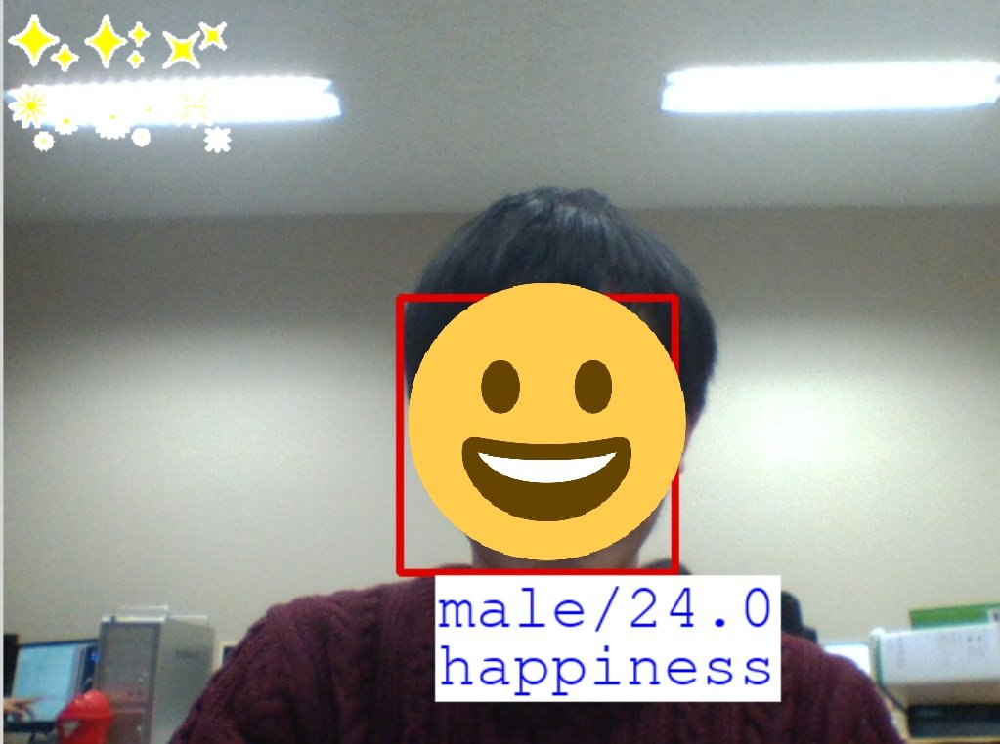

# Facial expression recognition app (PBL2018)

2018年度PBLで制作したWebアプリケーション。
PBLでのタイトルは『機械学習技術を用いた表情認識アプリケーション』。

## 動作内容

1. アプリを起動し、PCの内カメラで顔写真を撮る
2. 写真からMicrosoftのEmotion APIを通じて表情・年齢・性別を分析する
3. 分析結果を基に表情・年齢・性別を表示
4. 表情に合わせたスタンプをレコメンドして左上に表示

## 実行例

撮った写真から分析されて返ってきた情報「male(性別)/24.0(歳)/happiness(表情)」を顔の下に表示している。また、男性で笑顔という条件にあったスタンプを左上に表示している。ただし、現状ではスタンプの変更や移動ができない。

## 残った課題

現状ではスタンプの表示位置が固定であること、分析結果の表示方法などUIに関して改善の必要がある。また、今回のスタンプのレコメンド機能は1つの表情と性別あたり1つとなっており、モックのような状態であるため改善の必要がある。

## 参考

・Face APIのドキュメント https://docs.microsoft.com/ja-jp/azure/cognitive-services/face/

・[Python] FaceAPIを使った感情認識 https://qiita.com/t_aisu_ke/items/0089de5f234e74b7a333

・OpenCVでリアルタイム顔認識してFaceAPIで年齢とか取得する https://aokakes.hatenablog.com/entry/2018/11/02/214005